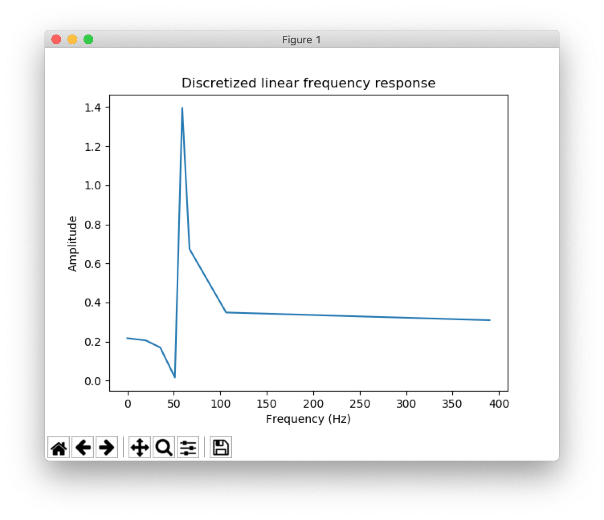

# FDLS Filter Design Algorithm

The FDLS (frequency-domain least squares) algorithm
converts discrete arrays of desired frequency, amplitude, phase, and delay samples,
to the optimal numerator and denominator coefficients of a 
IIR transfer function or difference function.
To do this, it computes the desired output values in Y,
the sequences of inputs and outputs (u and y) for N and D 
time samples away in X, and then computes the pseudoinverse
of this linear system of equations to find theta, the coefficients
of b and a.

### References

This algorithm was designed by Greg Berchin in his master's thesis "A New Algorithm for System Identification from Frequency Response Information," published in 1988 by U.C. Davis.
The algorithm is described in a digestible manner in Chapter 8 of his book "Precise Filter Design."

Here is a PDF of [Chapter 8](http://robotics.itee.uq.edu.au/~elec3004/2014/lectures/Precise%20Filter%20Design%20(chapter).pdf) which describes this exact algorithm. The sample data for the algorithm is taken from this chapter.

### Setup

Run either:

```bash
conda create -n fdls --file requirements.txt
conda activate fdls
```
or
```bash
conda env create -f environment.yml
conda activate fdls
```

### Example w/ data
```bash
python example.py
```
This will run our example using the sample data from the chapter,
and should generate graphs like this:

Input:


Output:


Just read `example.py`, it should be very simple to understand the implementation.

### Another (super basic) example usage
```python
import fdls
import data
import scipy
b, a = fdls.fdls(data.frequency, data.amplitude, data.phase, sample_delay=data.delay, n=2, d=2, fs=1000)

w, h = scipy.signal.freqz(b, a)
```
Plot `w` (frequencies) against `h` (amplitudes) to see the
continuous version of the discrete filter based on
the frequency samples provided via the coefficients `a` and `b`.
a and b are taps that you can export to any filter chip
or block in GNURadio.
